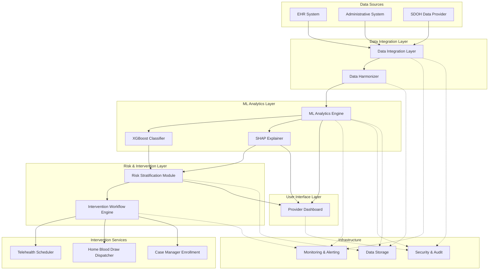

# Design Document: CKD Early Detection System

## Overview

The SDOH-CKDPred system is an AI-enabled early detection platform for Chronic Kidney Disease (CKD) that integrates clinical data with Social Determinants of Health (SDOH) to predict disease progression and trigger automated interventions. The system targets patients with Stage 2-3 CKD in underserved communities, predicting progression to Stage 4-5 within 24 months and automatically initiating telehealth consultations, home blood draws, and case management enrollment.

The architecture follows a layered approach with clear separation between data ingestion, ML analytics, risk stratification, intervention orchestration, and user interfaces. The system emphasizes explainability through SHAP analysis, health equity through fairness monitoring, and cost-effectiveness through comprehensive tracking.

Key design goals:
- Achieve AUROC ≥ 0.87 with equitable performance across racial/ethnic subgroups
- Process predictions in <500ms with explanations in <200ms
- Initiate automated interventions within 1 hour of high-risk classification
- Maintain HIPAA compliance with encryption and audit logging
- Demonstrate BCR ≥ 3.75:1 for cost-effectiveness

## Architecture

The system consists of seven major components organized in a layered architecture:



### Architectural Layers

1. **Data Integration Layer**: Ingests and harmonizes data from EHR, administrative systems, and SDOH providers
2. **ML Analytics Layer**: Performs prediction using XGBoost and generates SHAP explanations
3. **Risk & Intervention Layer**: Stratifies patients by risk and orchestrates automated interventions
4. **Intervention Services**: Executes specific intervention actions (telehealth, blood draws, case management)
5. **User Interface Layer**: Provides provider-facing dashboard for review and decision-making
6. **Infrastructure**: Cross-cutting concerns including monitoring, security, and data storage

### Design Decisions

**XGBoost Selection**: Chosen for its strong performance on tabular data, built-in handling of missing values, and compatibility with SHAP explainability. Gradient boosting provides better accuracy than linear models while remaining more interpretable than deep neural networks.

**SHAP for Explainability**: SHAP provides theoretically grounded feature attributions based on game theory, ensuring consistent and additive explanations. This is critical for clinical trust and regulatory compliance.

**Synchronous Prediction, Asynchronous Intervention**: Predictions are synchronous (500ms SLA) to support real-time dashboard queries, while interventions are asynchronous (1 hour SLA) to handle external system dependencies and retries.

**Three-Tier Risk Stratification**: Balances intervention resource allocation with clinical urgency. High-risk (>0.65) triggers full intervention workflow, moderate-risk (0.35-0.65) enables monitoring, low-risk (<0.35) requires no immediate action. Threshold of 0.65 was optimized using Youden's J statistic on validation data.

**Temporal Validation**: Training data chronologically precedes validation/test data to prevent data leakage and simulate real-world deployment where models predict future outcomes.

## Components and Interfaces

### Data Integration Layer

**Responsibilities**:
- Ingest clinical data (eGFR, UACR, HbA1c, BP, BMI, medications) from EHR systems
- Ingest administrative data (visit frequency, referrals, insurance) from billing systems
- Retrieve SDOH data (ADI, food deserts, housing, transportation) from external providers
- Harmonize data into unified patient records
- Handle ingestion failures gracefully with logging

**Interfaces**:
```python
class DataIntegrationLayer:
    def ingest_clinical_data(self, ehr_payload: Dict) -> ClinicalRecord:
        """Ingest clinical data from EHR system"""
        
    def ingest_administrative_data(self, admin_payload: Dict) -> AdministrativeRecord:
        """Ingest administrative data from billing system"""
        
    def retrieve_sdoh_data(self, patient_address: Address) -> SDOHRecord:
        """Retrieve SDOH data for patient address"""
        
    def harmonize_patient_record(
        self, 
        clinical: ClinicalRecord,
        administrative: AdministrativeRecord,
        sdoh: SDOHRecord
    ) -> UnifiedPatientRecord:
        """Combine data sources into unified record"""
```

**Data Flow**:
1. Receive data from source systems via API calls or batch files
2. Validate data format and required fields
3. Transform to internal schema
4. Enrich with SDOH data based on patient address
5. Store harmonized record in data warehouse
6. Log any ingestion failures with source identification

### ML Analytics Engine

**Responsibilities**:
- Load trained XGBoost model from model registry
- Extract features from unified patient records
- Generate risk scores (0-1) for Stage 2-3 CKD patients
- Compute SHAP explanations for each prediction
- Meet performance SLAs (500ms prediction, 200ms explanation)
- Support model retraining and A/B testing

**Interfaces**:
```python
class MLAnalyticsEngine:
    def predict_progression_risk(self, patient: UnifiedPatientRecord) -> PredictionResult:
        """Generate CKD progression risk score"""
        
    def explain_prediction(self, patient: UnifiedPatientRecord, prediction: float) -> SHAPExplanation:
        """Generate SHAP explanation for prediction"""
        
    def train_model(self, training_data: DataFrame, validation_data: DataFrame) -> ModelMetrics:
        """Train new XGBoost model with hyperparameter tuning"""
        
    def evaluate_model(self, test_data: DataFrame) -> PerformanceReport:
        """Evaluate model on held-out test set"""
        
    def deploy_model(self, model_id: str, ab_test_percentage: float) -> None:
        """Deploy model to production with optional A/B testing"""
```

**Feature Engineering**:
- Clinical features: eGFR, UACR, HbA1c, systolic/diastolic BP, BMI, medication counts
- Administrative features: visit frequency (last 12 months), specialist referrals, insurance type
- SDOH features: ADI percentile, food desert binary, housing instability score, transportation access score
- Temporal features: eGFR slope (change over last 12 months), time since CKD diagnosis
- Interaction features: eGFR × ADI, UACR × food desert status

**Model Training Pipeline**:
1. Load historical patient data with 24-month outcomes
2. Filter to Stage 2-3 CKD patients at baseline
3. Split temporally: 70% train, 15% validation, 15% test
4. Perform hyperparameter tuning on validation set (learning rate, max depth, subsample ratio)
5. Train final model on train + validation sets
6. Evaluate on held-out test set
7. Check fairness metrics across subgroups
8. Version and register model if performance criteria met

### XGBoost Classifier

**Responsibilities**:
- Binary classification for 24-month CKD progression
- Handle missing values through built-in imputation
- Provide feature importance scores
- Support incremental learning for model updates

**Configuration**:
```python
xgb_params = {
    'objective': 'binary:logistic',
    'eval_metric': 'auc',
    'max_depth': 6,
    'learning_rate': 0.05,
    'subsample': 0.8,
    'colsample_bytree': 0.8,
    'min_child_weight': 3,
    'scale_pos_weight': 2.5,  # Handle class imbalance
    'tree_method': 'hist',  # Fast histogram-based algorithm
}
```

### SHAP Explainer

**Responsibilities**:
- Compute Shapley values for all input features
- Identify top 5 contributing factors per prediction
- Categorize factors as clinical, administrative, or SDOH
- Normalize values to sum to (prediction - baseline)
- Generate explanations within 200ms

**Interfaces**:
```python
class SHAPExplainer:
    def compute_shap_values(self, patient: UnifiedPatientRecord, model: XGBoostModel) -> Dict[str, float]:
        """Compute SHAP values for all features"""
        
    def get_top_factors(self, shap_values: Dict[str, float], n: int = 5) -> List[Factor]:
        """Get top N contributing factors"""
        
    def categorize_factors(self, factors: List[Factor]) -> CategorizedFactors:
        """Categorize factors by type (clinical/administrative/SDOH)"""
```

**Implementation Approach**:
- Use TreeSHAP algorithm optimized for tree-based models
- Pre-compute background dataset (1000 representative samples) for efficiency
- Cache SHAP explainer object to avoid reinitialization overhead
- Parallelize SHAP computation across features when possible

### Risk Stratification Module

**Responsibilities**:
- Assign patients to risk tiers based on prediction scores
- Log tier changes with timestamps
- Provide risk tier summaries for dashboard

**Interfaces**:
```python
class RiskStratificationModule:
    def stratify_patient(self, risk_score: float) -> RiskTier:
        """Assign patient to risk tier"""
        
    def log_tier_change(self, patient_id: str, old_tier: RiskTier, new_tier: RiskTier) -> None:
        """Log risk tier change"""
        
    def get_tier_distribution(self) -> Dict[RiskTier, int]:
        """Get count of patients in each tier"""
```

**Risk Tier Definitions**:
- High-risk: score > 0.65 (triggers full intervention workflow, optimized via Youden's J statistic)
- Moderate-risk: 0.35 ≤ score ≤ 0.65 (monitoring and provider notification)
- Low-risk: score < 0.35 (routine care)

### Intervention Workflow Engine

**Responsibilities**:
- Orchestrate automated intervention workflows for high-risk patients
- Trigger all four intervention components in parallel
- Implement retry logic with exponential backoff
- Maintain audit trail of intervention steps
- Notify care coordination team on completion

**Interfaces**:
```python
class InterventionWorkflowEngine:
    def initiate_workflow(self, patient: UnifiedPatientRecord, risk_tier: RiskTier) -> WorkflowID:
        """Initiate intervention workflow for high-risk patient"""
        
    def retry_failed_step(self, workflow_id: WorkflowID, step: InterventionStep) -> None:
        """Retry failed intervention step with exponential backoff"""
        
    def get_workflow_status(self, workflow_id: WorkflowID) -> WorkflowStatus:
        """Get current status of intervention workflow"""
        
    def mark_workflow_complete(self, workflow_id: WorkflowID) -> None:
        """Mark workflow as complete and notify care team"""
```

**Workflow Steps**:
1. Provider notification (email/SMS to primary care provider)
2. Telehealth scheduling (via Telehealth Scheduler)
3. Home blood draw dispatch (via Home Blood Draw Dispatcher)
4. Case manager enrollment (via Case Manager Enrollment)

**Retry Strategy**:
- Max retries: 3 per step
- Backoff: 5 minutes, 15 minutes, 45 minutes
- Failure handling: Log error, notify operations team after final retry

### Telehealth Scheduler

**Responsibilities**:
- Check nephrology provider availability
- Schedule virtual appointments within 14 days
- Send appointment confirmations with video links
- Escalate if no availability within 14 days

**Interfaces**:
```python
class TelehealthScheduler:
    def check_availability(self, days_ahead: int = 14) -> List[AppointmentSlot]:
        """Check nephrology provider availability"""
        
    def schedule_appointment(self, patient_id: str, slot: AppointmentSlot) -> Appointment:
        """Schedule virtual nephrology appointment"""
        
    def send_confirmation(self, appointment: Appointment, contact_method: ContactMethod) -> None:
        """Send appointment confirmation to patient"""
        
    def escalate_scheduling(self, patient_id: str, reason: str) -> None:
        """Escalate to care coordination team"""
```

### Home Blood Draw Dispatcher

**Responsibilities**:
- Verify patient shipping address
- Dispatch blood draw kits within 2 business days
- Include instructions, prepaid labels, and requisition forms
- Send tracking information
- Schedule follow-up reminders

**Interfaces**:
```python
class HomeBloodDrawDispatcher:
    def verify_address(self, patient_id: str) -> Address:
        """Verify patient shipping address"""
        
    def dispatch_kit(self, patient_id: str, address: Address) -> ShipmentTracking:
        """Dispatch home blood draw kit"""
        
    def send_tracking(self, patient_id: str, tracking: ShipmentTracking) -> None:
        """Send tracking information to patient"""
        
    def schedule_reminder(self, patient_id: str, days_after_dispatch: int = 7) -> None:
        """Schedule follow-up reminder"""
```

### Case Manager Enrollment

**Responsibilities**:
- Assign patients to case managers based on capacity
- Create case records with risk factors and SDOH barriers
- Notify case managers within 24 hours
- Enforce caseload limits (max 50 active patients per manager)

**Interfaces**:
```python
class CaseManagerEnrollment:
    def assign_case_manager(self, patient_id: str) -> CaseManager:
        """Assign patient to available case manager"""
        
    def create_case_record(
        self, 
        patient: UnifiedPatientRecord,
        risk_factors: List[Factor],
        shap_explanation: SHAPExplanation
    ) -> CaseRecord:
        """Create case record with patient information"""
        
    def notify_case_manager(self, case_manager: CaseManager, case_record: CaseRecord) -> None:
        """Notify case manager of new enrollment"""
        
    def check_caseload_capacity(self, case_manager: CaseManager) -> int:
        """Check current caseload for case manager"""
```

### Provider Dashboard

**Responsibilities**:
- Display patient list with risk scores and tiers
- Support filtering by risk tier, CKD stage, date range
- Show detailed patient view with SHAP explanations
- Record provider acknowledgments
- Provide visual indicators for risk factors

**Interfaces**:
```python
class ProviderDashboard:
    def get_patient_list(self, filters: DashboardFilters) -> List[PatientSummary]:
        """Get filtered list of patients"""
        
    def get_patient_detail(self, patient_id: str) -> PatientDetail:
        """Get detailed patient view with explanations"""
        
    def record_acknowledgment(self, patient_id: str, provider_id: str) -> None:
        """Record provider acknowledgment of high-risk alert"""
        
    def get_risk_factor_visualization(self, shap_explanation: SHAPExplanation) -> Visualization:
        """Generate visual representation of risk factors"""
```

**UI Components**:
- Patient list table (sortable, filterable)
- Risk score gauge (color-coded by tier)
- SHAP waterfall chart (top 5 factors)
- Clinical timeline (eGFR trend, key events)
- SDOH indicator panel (ADI, food access, housing, transportation)

## Data Models

### UnifiedPatientRecord

```python
@dataclass
class UnifiedPatientRecord:
    patient_id: str
    demographics: Demographics
    clinical: ClinicalRecord
    administrative: AdministrativeRecord
    sdoh: SDOHRecord
    created_at: datetime
    updated_at: datetime
```

### Demographics

```python
@dataclass
class Demographics:
    age: int
    sex: str  # 'M', 'F'
    race: Optional[str]  # Not used in model, only for fairness monitoring
    ethnicity: Optional[str]  # Not used in model, only for fairness monitoring
    address: Address
```

### ClinicalRecord

```python
@dataclass
class ClinicalRecord:
    egfr: float  # mL/min/1.73m²
    egfr_history: List[Tuple[datetime, float]]  # For slope calculation
    uacr: float  # mg/g
    hba1c: float  # %
    systolic_bp: int  # mmHg
    diastolic_bp: int  # mmHg
    bmi: float  # kg/m²
    medications: List[Medication]
    ckd_stage: str  # '2', '3a', '3b'
    diagnosis_date: datetime
    comorbidities: List[str]  # Diabetes, hypertension, CVD
```

### AdministrativeRecord

```python
@dataclass
class AdministrativeRecord:
    visit_frequency_12mo: int  # Number of visits in last 12 months
    specialist_referrals: List[Referral]
    insurance_type: str  # 'Medicare', 'Medicaid', 'Commercial', 'Uninsured'
    insurance_status: str  # 'Active', 'Inactive'
    last_visit_date: datetime
```

### SDOHRecord

```python
@dataclass
class SDOHRecord:
    adi_percentile: int  # 1-100, higher = more disadvantaged
    food_desert: bool  # True if >1 mile from grocery store (urban) or >10 miles (rural)
    housing_stability_score: float  # 0-1, lower = less stable
    transportation_access_score: float  # 0-1, higher = better access
    rural_urban_code: str  # RUCA code
```

### PredictionResult

```python
@dataclass
class PredictionResult:
    patient_id: str
    risk_score: float  # 0-1
    risk_tier: RiskTier
    prediction_date: datetime
    model_version: str
    processing_time_ms: int
```

### SHAPExplanation

```python
@dataclass
class SHAPExplanation:
    patient_id: str
    baseline_risk: float  # Population average risk
    prediction: float  # Individual risk score
    shap_values: Dict[str, float]  # Feature name -> SHAP value
    top_factors: List[Factor]  # Top 5 contributing factors
    categorized_factors: CategorizedFactors
    computation_time_ms: int
```

### Factor

```python
@dataclass
class Factor:
    feature_name: str
    feature_value: Any
    shap_value: float  # Contribution to prediction
    category: str  # 'clinical', 'administrative', 'sdoh'
    direction: str  # 'increases_risk', 'decreases_risk'
```

### CategorizedFactors

```python
@dataclass
class CategorizedFactors:
    clinical: List[Factor]
    administrative: List[Factor]
    sdoh: List[Factor]
```

### RiskTier

```python
class RiskTier(Enum):
    HIGH = "high"  # score > 0.65
    MODERATE = "moderate"  # 0.35 <= score <= 0.65
    LOW = "low"  # score < 0.35
```

### WorkflowStatus

```python
@dataclass
class WorkflowStatus:
    workflow_id: str
    patient_id: str
    initiated_at: datetime
    steps: List[WorkflowStep]
    status: str  # 'in_progress', 'completed', 'failed'
    completed_at: Optional[datetime]
```

### WorkflowStep

```python
@dataclass
class WorkflowStep:
    step_name: str  # 'provider_notification', 'telehealth_scheduling', etc.
    status: str  # 'pending', 'in_progress', 'completed', 'failed'
    attempts: int
    last_attempt_at: Optional[datetime]
    completed_at: Optional[datetime]
    error_message: Optional[str]
```

### ModelMetrics

```python
@dataclass
class ModelMetrics:
    auroc: float
    sensitivity: float
    specificity: float
    ppv: float  # Positive predictive value
    npv: float  # Negative predictive value
    subgroup_metrics: Dict[str, SubgroupMetrics]  # By race/ethnicity
    training_date: datetime
    model_version: str
```

### SubgroupMetrics

```python
@dataclass
class SubgroupMetrics:
    subgroup_name: str
    sample_size: int
    auroc: float
    sensitivity: float
    specificity: float
    ppv: float
    npv: float
```

### CostEffectivenessReport

```python
@dataclass
class CostEffectivenessReport:
    reporting_period: str  # 'Q1 2024'
    intervention_costs: InterventionCosts
    avoided_costs: AvoidedCosts
    benefit_cost_ratio: float
    stratified_by_tier: Dict[RiskTier, float]
    stratified_by_region: Dict[str, float]
```

### InterventionCosts

```python
@dataclass
class InterventionCosts:
    telehealth_visits: float
    home_blood_draws: float
    case_management_hours: float
    total: float
```

### AvoidedCosts

```python
@dataclass
class AvoidedCosts:
    prevented_stage_4_5_progression: float
    prevented_hospitalizations: float
    prevented_dialysis: float
    total: float
```


## Correctness Properties

A property is a characteristic or behavior that should hold true across all valid executions of a system—essentially, a formal statement about what the system should do. Properties serve as the bridge between human-readable specifications and machine-verifiable correctness guarantees.

### Property 1: Clinical Data Ingestion Completeness

For any EHR payload containing clinical data, the Data Integration Layer should extract and store all required fields: eGFR, UACR, HbA1c, blood pressure, BMI, and medication records in the resulting ClinicalRecord.

**Validates: Requirements 1.1**

### Property 2: Administrative Data Ingestion Completeness

For any administrative system payload, the Data Integration Layer should extract and store all required fields: visit frequency, referral records, and insurance status in the resulting AdministrativeRecord.

**Validates: Requirements 1.2**

### Property 3: SDOH Data Retrieval Completeness

For any patient address, the Data Integration Layer should retrieve and store all required SDOH fields: ADI score, food desert status, housing stability indicators, and transportation access metrics in the resulting SDOHRecord.

**Validates: Requirements 1.3**

### Property 4: Data Harmonization Combines All Sources

For any clinical record, administrative record, and SDOH record, the harmonization function should produce a UnifiedPatientRecord containing data from all three sources.

**Validates: Requirements 1.4**

### Property 5: Data Ingestion Error Handling

For any data ingestion failure in any channel (clinical, administrative, or SDOH), the system should log the error with source identification and continue processing available data from other channels.

**Validates: Requirements 1.5**

### Property 6: Risk Score Bounds

For any patient record with Stage 2-3 CKD, the ML Analytics Engine should generate a risk score in the range [0, 1].

**Validates: Requirements 2.1**

### Property 7: Prediction Uses All Feature Types

For any prediction, modifying features from clinical, administrative, or SDOH categories should affect the prediction output, demonstrating that all three feature types contribute to predictions.

**Validates: Requirements 2.3**

### Property 8: Prediction Latency

For any patient record, the ML Analytics Engine should complete prediction processing in 500 milliseconds or less.

**Validates: Requirements 2.4**

### Property 9: SHAP Completeness

For any prediction, the SHAP Explainer should compute feature importance values for all input features used in the prediction.

**Validates: Requirements 3.1**

### Property 10: SHAP Top Factors

For any prediction, the SHAP Explainer should identify the top 5 contributing factors (or fewer if there are fewer than 5 features total).

**Validates: Requirements 3.2**

### Property 11: SHAP Factor Categorization

For any prediction, every factor in the SHAP explanation should be categorized as clinical, administrative, or SDOH.

**Validates: Requirements 3.3**

### Property 12: SHAP Value Normalization

For any prediction, the sum of all SHAP values should equal the difference between the prediction and the baseline risk (within numerical precision tolerance).

**Validates: Requirements 3.4**

### Property 13: SHAP Explanation Latency

For any prediction, the SHAP Explainer should generate explanations within 200 milliseconds of prediction completion.

**Validates: Requirements 3.5**

### Property 14: Risk Tier Assignment Correctness

For any risk score, the Risk Stratification Module should assign the correct tier: HIGH for scores > 0.65, MODERATE for scores in [0.35, 0.65], and LOW for scores < 0.35.

**Validates: Requirements 4.1, 4.2, 4.3, 4.4**

### Property 15: Risk Tier Change Logging

For any risk tier change for a patient, the system should create a log entry containing the timestamp and the previous tier.

**Validates: Requirements 4.5**

### Property 16: High-Risk Workflow Initiation Timing

For any patient classified as high-risk, the Intervention Workflow Engine should initiate the automated intervention workflow within 1 hour.

**Validates: Requirements 5.1**

### Property 17: Intervention Workflow Completeness

For any high-risk patient workflow, the Intervention Workflow Engine should trigger all four intervention components (provider notification, telehealth scheduling, home blood draw dispatch, and case manager enrollment) and create an audit trail with timestamps for each step.

**Validates: Requirements 5.2, 5.3**

### Property 18: Intervention Step Retry Logic

For any failed intervention step, the Intervention Workflow Engine should retry the step up to 3 times with exponential backoff before marking it as permanently failed.

**Validates: Requirements 5.4**

### Property 19: Workflow Completion Notification

For any intervention workflow where all steps complete successfully, the workflow status should be marked as 'completed' and a notification should be sent to the care coordination team.

**Validates: Requirements 5.5**

### Property 20: Dashboard Patient List Completeness

For any provider dashboard access, the patient list should display risk scores, risk tiers, and prediction dates for all patients in the system.

**Validates: Requirements 6.1**

### Property 21: Dashboard Filtering Correctness

For any filter criteria (risk tier, CKD stage, or date range), the dashboard should return only patients matching all specified filter conditions.

**Validates: Requirements 6.2**

### Property 22: Dashboard Patient Detail Display

For any patient selected in the dashboard, the detail view should display the top 5 SHAP explanation factors, clinical values, administrative metrics, and SDOH indicators.

**Validates: Requirements 6.3, 6.4**

### Property 23: Provider Acknowledgment Recording

For any provider acknowledgment of a high-risk alert, the system should create a record containing the provider ID and timestamp.

**Validates: Requirements 6.5**

### Property 24: Telehealth Availability Check

For any high-risk patient identified, the Telehealth Scheduler should check nephrology provider availability within the next 14 days.

**Validates: Requirements 7.1**

### Property 25: Earliest Appointment Selection

For any telehealth scheduling request with available appointments, the system should select the earliest available appointment slot.

**Validates: Requirements 7.2**

### Property 26: Appointment Confirmation Completeness

For any scheduled telehealth appointment, the confirmation sent to the patient should include the video conference link, appointment time, and preparation instructions.

**Validates: Requirements 7.3, 7.4**

### Property 27: Telehealth Scheduling Escalation

For any scheduling request where no nephrology appointments are available within 14 days, the system should escalate to the care coordination team and attempt scheduling within 21 days.

**Validates: Requirements 7.5**

### Property 28: Blood Draw Address Verification

For any high-risk patient identified, the Home Blood Draw Dispatcher should verify the patient's shipping address before dispatching a kit.

**Validates: Requirements 8.1**

### Property 29: Blood Draw Kit Dispatch Timing

For any blood draw kit dispatch request, the kit should be dispatched within 2 business days.

**Validates: Requirements 8.2**

### Property 30: Blood Draw Kit Contents

For any dispatched blood draw kit, it should include collection instructions, a prepaid return shipping label, and required lab requisition forms.

**Validates: Requirements 8.3**

### Property 31: Blood Draw Tracking Notification

For any dispatched blood draw kit, tracking information should be sent to the patient.

**Validates: Requirements 8.4**

### Property 32: Blood Draw Follow-up Reminder

For any dispatched kit where no sample has been received within 7 days, a follow-up reminder should be scheduled and sent to the patient.

**Validates: Requirements 8.5**

### Property 33: Case Manager Assignment by Capacity

For any high-risk patient enrollment, the patient should be assigned to a case manager with available capacity (current caseload < 50).

**Validates: Requirements 9.1**

### Property 34: Case Record Completeness

For any case manager enrollment, the case record should contain patient demographics, risk factors, and SDOH barriers.

**Validates: Requirements 9.2**

### Property 35: Case Manager Notification Timing

For any patient enrollment, the assigned case manager should be notified within 24 hours.

**Validates: Requirements 9.3**

### Property 36: Case Record SHAP Inclusion

For any case record created, it should include SHAP explanation factors to guide case manager interventions.

**Validates: Requirements 9.4**

### Property 37: Case Manager Caseload Limit

For any case manager at any time, their active high-risk patient caseload should not exceed 50 patients.

**Validates: Requirements 9.5**

### Property 38: Fairness Monitoring by Subgroup

For any performance monitoring report, the system should track and report prediction performance separately for all five racial/ethnic subgroups (White, Black, Hispanic, Asian, Other).

**Validates: Requirements 10.2**

### Property 39: Fairness Disparity Flagging

For any performance report where the AUROC disparity between any two subgroups exceeds 0.05, the system should flag the model for retraining.

**Validates: Requirements 10.3**

### Property 40: Quarterly Fairness Report Completeness

For any quarterly fairness report, it should include sensitivity, specificity, and positive predictive value comparisons across all subgroups.

**Validates: Requirements 10.4**

### Property 41: Training Data Split Proportions

For any training dataset, the data split should allocate 70% to training, 15% to validation, and 15% to test sets (within rounding tolerance).

**Validates: Requirements 11.1**

### Property 42: Temporal Validation Ordering

For any data split, the maximum date in the training set should be less than the minimum date in the validation set, and the maximum date in the validation set should be less than the minimum date in the test set.

**Validates: Requirements 11.2**

### Property 43: Model Performance Report Completeness

For any completed model training, the performance report should include all five metrics: AUROC, sensitivity, specificity, PPV, and NPV.

**Validates: Requirements 11.5**

### Property 44: Intervention Cost Tracking Completeness

For any cost tracking period, the system should track all three intervention cost categories: telehealth visits, home blood draws, and case management hours.

**Validates: Requirements 12.1**

### Property 45: Avoided Cost Tracking Completeness

For any cost tracking period, the system should track both types of avoided costs: prevented Stage 4-5 CKD progression and prevented hospitalizations.

**Validates: Requirements 12.2**

### Property 46: Benefit-Cost Ratio Calculation

For any quarterly cost-effectiveness report, the benefit-cost ratio should be calculated as total avoided costs divided by total intervention costs.

**Validates: Requirements 12.3**

### Property 47: Cost-Effectiveness Report Stratification

For any cost-effectiveness report, it should include stratification by both patient risk tier and geographic region.

**Validates: Requirements 12.5**

### Property 48: Data at Rest Encryption

For any patient data stored in the system, it should be encrypted using AES-256 encryption.

**Validates: Requirements 13.1**

### Property 49: Data in Transit Encryption

For any data transmission between system components or to external systems, it should be encrypted using TLS 1.3 or higher.

**Validates: Requirements 13.2**

### Property 50: Data Access Authentication and Authorization

For any attempt to access patient data, the system should authenticate the user and verify role-based access permissions before granting access.

**Validates: Requirements 13.3**

### Property 51: Data Access Audit Logging

For any patient data access event, the system should create a log entry containing the user ID, timestamp, and data elements accessed.

**Validates: Requirements 13.4**

### Property 52: Training Data De-identification

For any data used for model training or research purposes, it should be automatically de-identified with all PII removed.

**Validates: Requirements 13.5**

### Property 53: System Monitoring Metric Coverage

The monitoring system should track all three required metrics: prediction latency, data ingestion success rates, and intervention workflow completion rates.

**Validates: Requirements 14.1**

### Property 54: Prediction Latency Alerting

For any prediction with latency exceeding 1 second, the system should send an alert to the operations team.

**Validates: Requirements 14.2**

### Property 55: Data Ingestion Failure Alerting

For any 1-hour period where the data ingestion failure rate exceeds 5%, the system should send an alert to the data engineering team.

**Validates: Requirements 14.3**

### Property 56: Real-time Metrics Dashboard

The system health dashboard should display metrics that are updated within a reasonable time window (e.g., within 5 minutes of the actual event).

**Validates: Requirements 14.4**

### Property 57: Daily Performance Report Generation

The system should generate daily summary reports containing system performance metrics and intervention outcomes.

**Validates: Requirements 14.5**

### Property 58: Model Performance Comparison

For any newly trained model, the system should compare its performance against the current production model using a held-out test set before deployment.

**Validates: Requirements 15.2**

### Property 59: Model Promotion Threshold

For any newly trained model that achieves at least 0.02 AUROC improvement over the current production model, the system should promote the new model to production.

**Validates: Requirements 15.3**

### Property 60: Model Versioning and Rollback

For any model deployed to production, the system should assign a version identifier and maintain rollback capability to the previous model version.

**Validates: Requirements 15.4**

### Property 61: A/B Testing Traffic Split

For any new model deployment with A/B testing enabled, the system should route exactly 10% of prediction traffic to the new model and 90% to the current production model.

**Validates: Requirements 15.5**


## Error Handling

The system implements comprehensive error handling across all components to ensure reliability and graceful degradation.

### Data Integration Layer Errors

**EHR Connection Failures**:
- Retry with exponential backoff (5s, 15s, 45s)
- Log error with source system identification
- Continue processing other data sources
- Alert data engineering team after 3 failed retries

**Missing Required Fields**:
- Log warning with patient ID and missing fields
- Use default values for non-critical fields
- Skip record if critical fields (eGFR, patient ID) are missing
- Generate daily report of incomplete records

**SDOH Data Unavailable**:
- Use regional averages for ADI if address-specific data unavailable
- Flag record as having imputed SDOH data
- Continue with prediction using available data
- Log imputation for audit purposes

### ML Analytics Engine Errors

**Model Loading Failures**:
- Attempt to load previous model version
- Alert ML engineering team immediately
- Return HTTP 503 (Service Unavailable) for prediction requests
- Log error with model version and stack trace

**Prediction Timeouts**:
- Cancel prediction after 1 second
- Log timeout with patient ID and feature summary
- Return error to caller with retry recommendation
- Alert operations team if timeout rate exceeds 1%

**Invalid Feature Values**:
- Apply feature validation before prediction
- Use median imputation for out-of-range continuous features
- Log validation errors with patient ID
- Proceed with prediction using corrected features

**SHAP Computation Failures**:
- Return prediction without explanation
- Log SHAP error with patient ID and model version
- Alert ML engineering team
- Allow prediction to complete successfully

### Intervention Workflow Engine Errors

**Telehealth Scheduling Failures**:
- Retry up to 3 times with exponential backoff
- Escalate to care coordination team after final retry
- Log failure with patient ID and error details
- Continue with other intervention steps

**Home Blood Draw Dispatch Failures**:
- Verify address before retry
- Attempt alternative shipping methods
- Escalate to care coordination after 3 failures
- Log all attempts with timestamps

**Case Manager Assignment Failures**:
- Check for case managers with capacity
- If all at capacity, assign to manager with lowest caseload
- Alert care coordination team of capacity issue
- Log assignment with capacity metrics

**Notification Failures**:
- Retry with alternative contact methods (email → SMS → phone)
- Log all notification attempts
- Mark notification as failed after all methods exhausted
- Generate daily report of failed notifications

### Provider Dashboard Errors

**Authentication Failures**:
- Return HTTP 401 (Unauthorized)
- Log failed authentication attempt with username and IP
- Implement rate limiting after 5 failed attempts
- Alert security team for suspicious patterns

**Authorization Failures**:
- Return HTTP 403 (Forbidden)
- Log unauthorized access attempt with user ID and resource
- Display user-friendly error message
- Do not reveal existence of restricted resources

**Query Timeouts**:
- Implement 5-second timeout for dashboard queries
- Return partial results with timeout indicator
- Log slow queries for optimization
- Suggest narrower filter criteria to user

### Security and Compliance Errors

**Encryption Failures**:
- Fail closed (reject operation rather than proceed unencrypted)
- Log encryption error with operation type
- Alert security team immediately
- Return error to caller

**Audit Log Failures**:
- Buffer audit logs in memory temporarily
- Retry log write with exponential backoff
- Alert operations team if buffer exceeds threshold
- Never proceed with operation if audit logging permanently fails

**De-identification Failures**:
- Fail closed (do not use data if de-identification fails)
- Log failure with data type and error
- Alert data engineering team
- Manual review required before retry

## Testing Strategy

The testing strategy employs a dual approach combining unit tests for specific examples and edge cases with property-based tests for universal correctness guarantees.

### Property-Based Testing

Property-based testing validates that the correctness properties defined in this document hold across a wide range of generated inputs. This approach provides comprehensive coverage and catches edge cases that might be missed by example-based testing.

**Framework Selection**:
- Python: Hypothesis library
- Configuration: Minimum 100 iterations per property test
- Shrinking: Enabled to find minimal failing examples

**Property Test Organization**:
Each correctness property from this design document will be implemented as a property-based test with the following structure:

```python
from hypothesis import given, strategies as st
import pytest

@given(
    egfr=st.floats(min_value=15.0, max_value=89.0),
    uacr=st.floats(min_value=0.0, max_value=5000.0),
    # ... other clinical features
    adi=st.integers(min_value=1, max_value=100),
    # ... other SDOH features
)
@pytest.mark.property_test
def test_property_6_risk_score_bounds(egfr, uacr, adi, ...):
    """
    Feature: ckd-early-detection-system, Property 6: Risk Score Bounds
    
    For any patient record with Stage 2-3 CKD, the ML Analytics Engine 
    should generate a risk score in the range [0, 1].
    """
    patient = create_patient_record(egfr=egfr, uacr=uacr, adi=adi, ...)
    prediction = ml_engine.predict_progression_risk(patient)
    
    assert 0.0 <= prediction.risk_score <= 1.0
```

**Custom Generators**:
Implement custom Hypothesis strategies for complex domain objects:

```python
@st.composite
def patient_record_strategy(draw):
    """Generate valid UnifiedPatientRecord instances"""
    return UnifiedPatientRecord(
        patient_id=draw(st.uuids()),
        demographics=draw(demographics_strategy()),
        clinical=draw(clinical_record_strategy()),
        administrative=draw(administrative_record_strategy()),
        sdoh=draw(sdoh_record_strategy()),
        created_at=draw(st.datetimes()),
        updated_at=draw(st.datetimes()),
    )

@st.composite
def clinical_record_strategy(draw):
    """Generate valid ClinicalRecord instances for Stage 2-3 CKD"""
    return ClinicalRecord(
        egfr=draw(st.floats(min_value=30.0, max_value=89.0)),  # Stage 2-3 range
        uacr=draw(st.floats(min_value=0.0, max_value=5000.0)),
        hba1c=draw(st.floats(min_value=4.0, max_value=14.0)),
        systolic_bp=draw(st.integers(min_value=80, max_value=200)),
        diastolic_bp=draw(st.integers(min_value=40, max_value=130)),
        bmi=draw(st.floats(min_value=15.0, max_value=60.0)),
        # ... other fields
    )
```

**Property Test Coverage**:
All 61 correctness properties will be implemented as property-based tests, organized by component:

- Data Integration Layer: Properties 1-5 (5 tests)
- ML Analytics Engine: Properties 6-8, 38-43, 58-61 (14 tests)
- SHAP Explainer: Properties 9-13 (5 tests)
- Risk Stratification: Properties 14-15 (2 tests)
- Intervention Workflow: Properties 16-19 (4 tests)
- Provider Dashboard: Properties 20-23 (4 tests)
- Telehealth Scheduler: Properties 24-27 (4 tests)
- Home Blood Draw: Properties 28-32 (5 tests)
- Case Manager Enrollment: Properties 33-37 (5 tests)
- Cost Tracking: Properties 44-47 (4 tests)
- Security: Properties 48-52 (5 tests)
- Monitoring: Properties 53-57 (5 tests)

### Unit Testing

Unit tests complement property-based tests by validating specific examples, edge cases, and integration points.

**Example-Based Tests**:
Specific scenarios that demonstrate correct behavior:

```python
def test_high_risk_patient_workflow():
    """Test complete workflow for a specific high-risk patient"""
    patient = create_test_patient(
        egfr=25.0,  # Low eGFR
        uacr=500.0,  # High UACR
        adi=95,  # High deprivation
    )
    
    prediction = ml_engine.predict_progression_risk(patient)
    assert prediction.risk_score > 0.7
    assert prediction.risk_tier == RiskTier.HIGH
    
    workflow = intervention_engine.initiate_workflow(patient, prediction.risk_tier)
    assert workflow.status == 'in_progress'
    assert len(workflow.steps) == 4
```

**Edge Case Tests**:
Boundary conditions and special cases:

```python
def test_prediction_with_missing_sdoh_data():
    """Test prediction when SDOH data is unavailable"""
    patient = create_test_patient(sdoh=None)
    prediction = ml_engine.predict_progression_risk(patient)
    
    assert prediction.risk_score is not None
    assert 0.0 <= prediction.risk_score <= 1.0
    # Should use regional averages for SDOH

def test_risk_score_exactly_at_threshold():
    """Test tier assignment at exact threshold values"""
    assert stratify_patient(0.65) == RiskTier.HIGH
    assert stratify_patient(0.35) == RiskTier.MODERATE
    assert stratify_patient(0.34999) == RiskTier.LOW

def test_empty_patient_list_dashboard():
    """Test dashboard with no patients"""
    patients = dashboard.get_patient_list(filters={})
    assert patients == []
```

**Integration Tests**:
End-to-end workflows across multiple components:

```python
def test_complete_prediction_to_intervention_flow():
    """Test full flow from data ingestion to intervention"""
    # Ingest data
    clinical = data_layer.ingest_clinical_data(ehr_payload)
    admin = data_layer.ingest_administrative_data(admin_payload)
    sdoh = data_layer.retrieve_sdoh_data(patient_address)
    patient = data_layer.harmonize_patient_record(clinical, admin, sdoh)
    
    # Generate prediction
    prediction = ml_engine.predict_progression_risk(patient)
    explanation = ml_engine.explain_prediction(patient, prediction.risk_score)
    
    # Stratify risk
    tier = risk_module.stratify_patient(prediction.risk_score)
    
    # Trigger intervention if high-risk
    if tier == RiskTier.HIGH:
        workflow = intervention_engine.initiate_workflow(patient, tier)
        assert workflow.status == 'in_progress'
```

**Performance Tests**:
Validate latency requirements:

```python
import time

def test_prediction_latency_requirement():
    """Test that predictions complete within 500ms"""
    patient = create_test_patient()
    
    start = time.time()
    prediction = ml_engine.predict_progression_risk(patient)
    elapsed_ms = (time.time() - start) * 1000
    
    assert elapsed_ms <= 500

def test_shap_explanation_latency_requirement():
    """Test that SHAP explanations complete within 200ms"""
    patient = create_test_patient()
    prediction = ml_engine.predict_progression_risk(patient)
    
    start = time.time()
    explanation = ml_engine.explain_prediction(patient, prediction.risk_score)
    elapsed_ms = (time.time() - start) * 1000
    
    assert elapsed_ms <= 200
```

**Model Validation Tests**:
One-time tests for model performance requirements:

```python
def test_model_auroc_requirement():
    """Test that model achieves AUROC >= 0.87 on validation set"""
    validation_data = load_validation_dataset()
    metrics = ml_engine.evaluate_model(validation_data)
    
    assert metrics.auroc >= 0.87

def test_model_fairness_requirement():
    """Test that model AUROC is within 0.05 across subgroups"""
    test_data = load_test_dataset()
    metrics = ml_engine.evaluate_model(test_data)
    
    aurocs = [m.auroc for m in metrics.subgroup_metrics.values()]
    max_disparity = max(aurocs) - min(aurocs)
    
    assert max_disparity <= 0.05

def test_training_data_excludes_race_ethnicity():
    """Test that race and ethnicity are not used as model features"""
    feature_names = ml_engine.get_feature_names()
    
    assert 'race' not in feature_names
    assert 'ethnicity' not in feature_names
```

**Security Tests**:
Validate security requirements:

```python
def test_data_at_rest_encryption():
    """Test that stored patient data is encrypted"""
    patient = create_test_patient()
    storage.save_patient(patient)
    
    raw_data = storage.read_raw_bytes(patient.patient_id)
    # Should not contain plaintext patient data
    assert patient.patient_id not in raw_data.decode('utf-8', errors='ignore')

def test_unauthorized_access_blocked():
    """Test that unauthorized users cannot access patient data"""
    with pytest.raises(AuthorizationError):
        dashboard.get_patient_detail(
            patient_id='test-patient',
            user=create_user(role='unauthorized')
        )

def test_audit_log_created_on_access():
    """Test that data access creates audit log entry"""
    user = create_user(role='provider')
    patient_id = 'test-patient'
    
    dashboard.get_patient_detail(patient_id=patient_id, user=user)
    
    logs = audit_system.get_logs(patient_id=patient_id)
    assert len(logs) > 0
    assert logs[-1].user_id == user.user_id
    assert logs[-1].data_elements == ['patient_detail']
```

### Test Organization

```
tests/
├── unit/
│   ├── test_data_integration.py
│   ├── test_ml_analytics.py
│   ├── test_shap_explainer.py
│   ├── test_risk_stratification.py
│   ├── test_intervention_workflow.py
│   ├── test_telehealth_scheduler.py
│   ├── test_home_blood_draw.py
│   ├── test_case_manager_enrollment.py
│   ├── test_provider_dashboard.py
│   ├── test_security.py
│   └── test_monitoring.py
├── property/
│   ├── test_properties_data_integration.py
│   ├── test_properties_ml_analytics.py
│   ├── test_properties_shap.py
│   ├── test_properties_risk_stratification.py
│   ├── test_properties_intervention.py
│   ├── test_properties_dashboard.py
│   ├── test_properties_telehealth.py
│   ├── test_properties_blood_draw.py
│   ├── test_properties_case_management.py
│   ├── test_properties_cost_tracking.py
│   ├── test_properties_security.py
│   └── test_properties_monitoring.py
├── integration/
│   ├── test_end_to_end_workflow.py
│   ├── test_model_training_pipeline.py
│   └── test_data_pipeline.py
├── performance/
│   ├── test_prediction_latency.py
│   ├── test_explanation_latency.py
│   └── test_dashboard_query_performance.py
└── model_validation/
    ├── test_model_performance.py
    ├── test_model_fairness.py
    └── test_model_deployment.py
```

### Continuous Integration

All tests run automatically on every commit:

1. Unit tests (fast, run first)
2. Property-based tests (100 iterations per property)
3. Integration tests
4. Performance tests (on representative hardware)
5. Security tests

Model validation tests run:
- During model training pipeline
- Before model deployment to production
- Quarterly as part of model retraining

### Test Coverage Goals

- Line coverage: ≥ 90% for all production code
- Branch coverage: ≥ 85% for all production code
- Property test coverage: 100% of correctness properties
- Critical path coverage: 100% (data ingestion → prediction → intervention)

